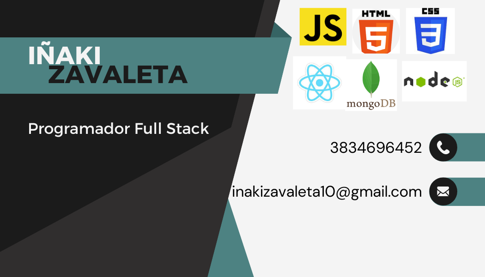

## Who i am??
Hello, I am Iñaki Zavaleta, junior full stack programmer from Argentina. Passionate about programming and continuing to learn new things, I am at your disposal for anything.

#  Languages and Technologies:

           
 

<!---
inakizavaleta10/inakizavaleta10 is a ✨ special ✨ repository because its `README.md` (this file) appears on your GitHub profile.
You can click the Preview link to take a look at your changes.
--->
